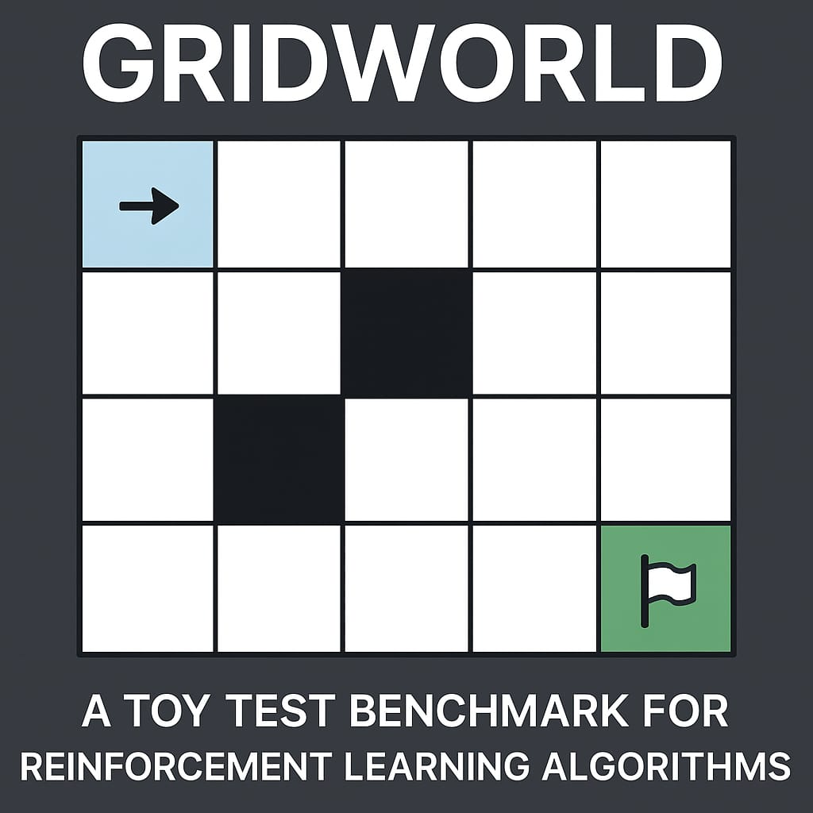

<h1>🌟 Algorithms for Inverse Reinforcement Learning</h1>

<!-- TABLE OF CONTENTS -->

  
Table of Contents

  <ol>
    <li>
      <a href="#-gridworld-algorithms-implemented">Gridworld Algorithms Implemented</a>
    </li>
    <li>
      <a href="#-step-by-step-guide">Step by Step Guide</a>
    </li>
    <li>
      <a href="#-references">References</a>
    </li>
    <li>
      <a href="#-contributing">Contributing</a>
    </li>
    <li>
      <a href="#-license">License</a>
    </li>
  </ol>

This repo implements the following algorithms in a Java application with a GUI: 

- Value Iteration [[**1**](#References)] 
- Inverse Reinforcement Learning (IRL) [[**2**](#References)]   

It allows you define any gridworld environment similar to what you find in [[**2**](#References)] at _Section 5. IRL from Sampled Trajectories_. It allows you to define the received reward by the agent when it switches to the absorbing (goal) state of the grid as well as the reward received by the agent when it switches to a non-absorbing statte. You can define the following parameters of the IRL algorithm: RMax, Min and Max Lambada and Lambada Step. It will then output the predicted reward function as highlighted in the IRL algorithm. See section below _Step-by-step Guide_ on how to run this tool.

 
[Reinforcement Learning book](#References)

# 📖 Gridworld Algorithms Implemented

- Value Iteration [[**1**](#References)] 
- Inverse Reinforcement Learning [[**2**](#References)]   

# ✨ Step by Step Guide

Gridworld experiment (Figures 1 and 2 of article)
Run class TRLMain.java or execute the JAR file: java -jar TRLMain-1.0.0.jar.

**Step 1**: Run TRLMain. A window with a standard 5x5 square gridworld appears. 
 
 
**Step 2**: Run action Create 2. Agent. The initial state is indicated by a blue square, the goal state is indicated by a blue circle.  
 
 
 
**Step 3**: Run action Create 3. Reward Function. It will define the reward received when transition to the goal state (eg, positive value) and the reward received when transitioning to non absorbing states (eg, zero). 
 
 
 
**Step 4**: Run action Reinforcement Learning 1. Value Iteration. Finds an optimal policy, blue arrows. The red numbers are the Q-values for the actions in each state. 
 
 
**Step 5**: Run action Reinforcement Learning 2. Inverse Reinforcement Learning. Finds the reward function using Inverse Reinforcement Learning (IRL). 
 
 

# 🤝 Contributing

Contributions are welcome! Feel free to:

1. Fork the project
2. Create a branch for your feature (`git checkout -b feature/AmazingFeature`)
3. Commit your changes (`git commit -m 'Add some AmazingFeature'`)
4. Push to the branch (`git push origin feature/AmazingFeature`)
5. Open a Pull Request

# 📚 References

[**1**] [Reinforcement Learning: An Introduction](http://incompleteideas.net/book/the-book-2nd.html), Richard S. Sutton and Andrew G. Barto. 
[**2**] [Algorithms for Inverse Reinforcement Learning](http://ai.stanford.edu/~ang/papers/icml00-irl.pdf). AY Ng, SJ Russell - Icml, 2000 - ai.stanford.edu.
[**3**] [SSparse Interactions in Multi-Agent Reinforcement Learning](https://ai.vub.ac.be/wp-content/uploads/2019/12/Sparse-Interactions-in-Multi-Agent-Reinforcement-Learning.pdf). Yann-Michaël De Hauwere, PhD Thesis, VUB, 2011.

# 📝 License

This project is licensed under the MIT License. See the [LICENSE](LICENSE) file for details.

